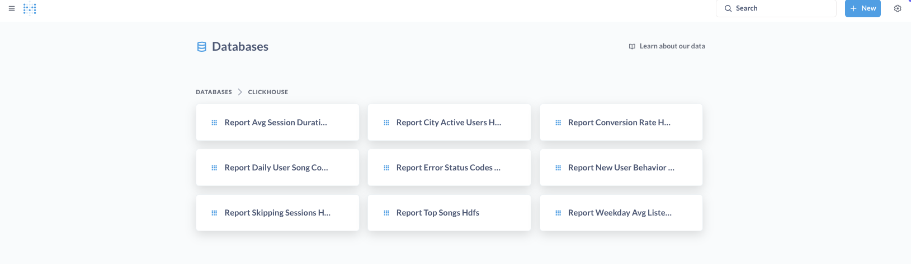
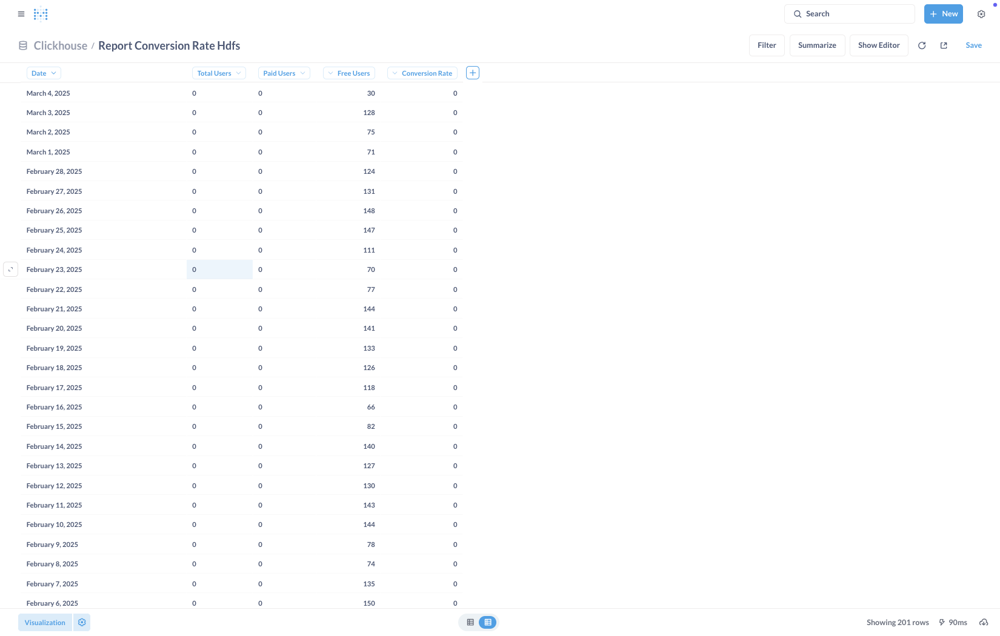
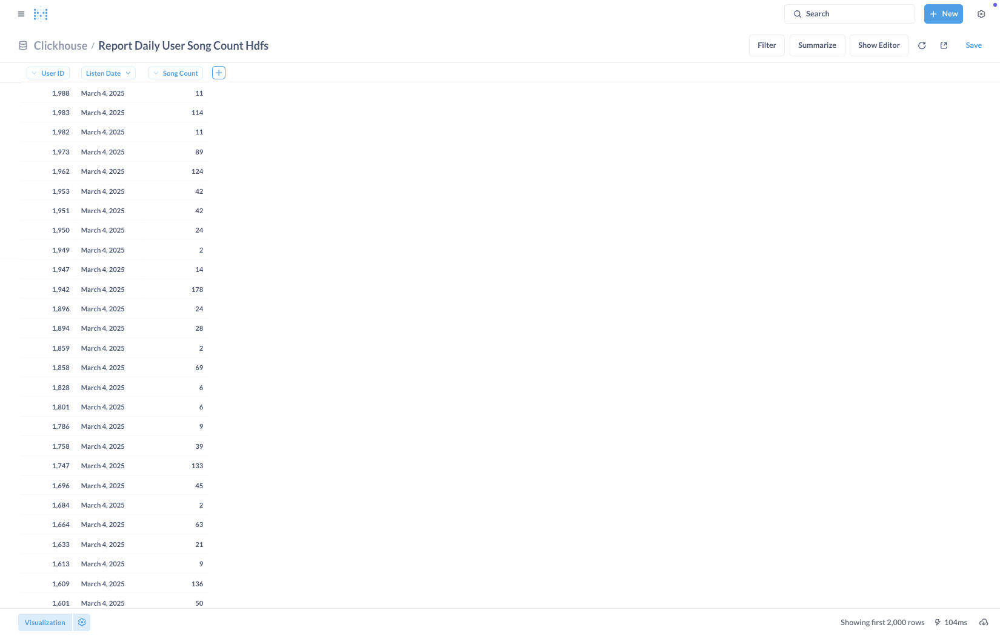
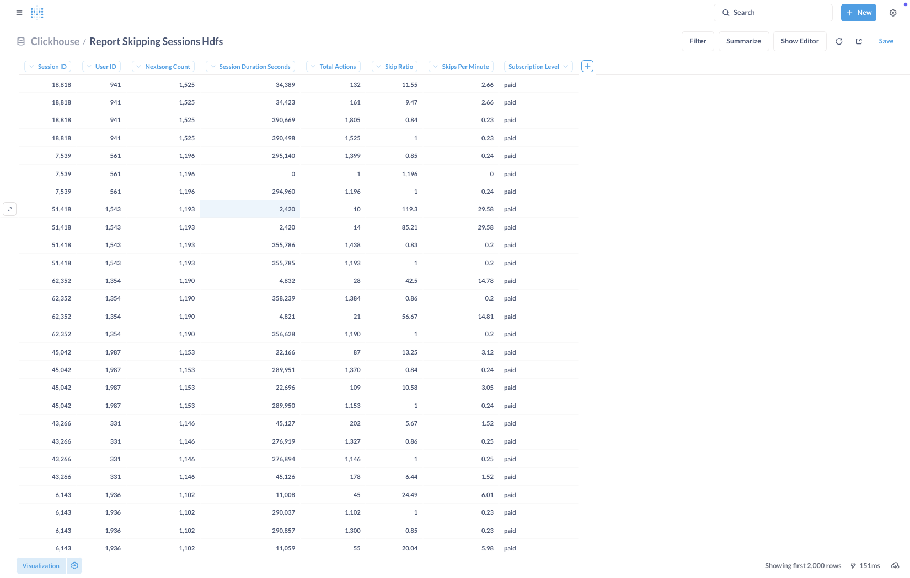
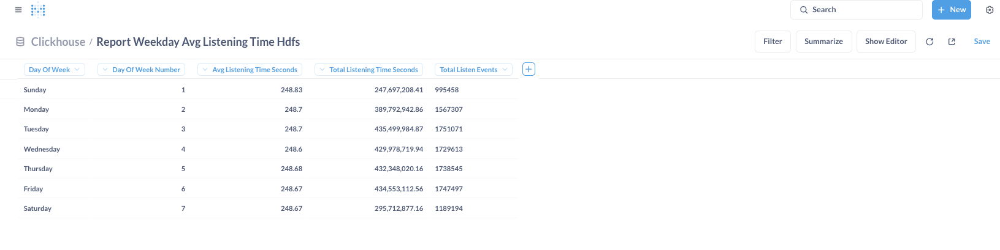

# ClickHouse

- Based on this [SQL file](../clickhouse/table_definition_and_insert_data.sql), a database is created and all tables are created in ClickHouse, and data is inserted from HDFS to ClickHouse using engines.

# Metabase
## All Tables

## Dashboard is:

### General:

### Health Check:

## Report Avg Session Duration Hdfs

## Report City Active Users Hdfs

## Report Conversion Rate Hdfs

## Report Daily User Song Count Hdfs

## Report Error Codes Hdfs  

## Report 6

## Report Skipping Sessions Hdfs

## Report Top Songs Hdfs

## Report Weekday Avg Listening Time Hdfs
