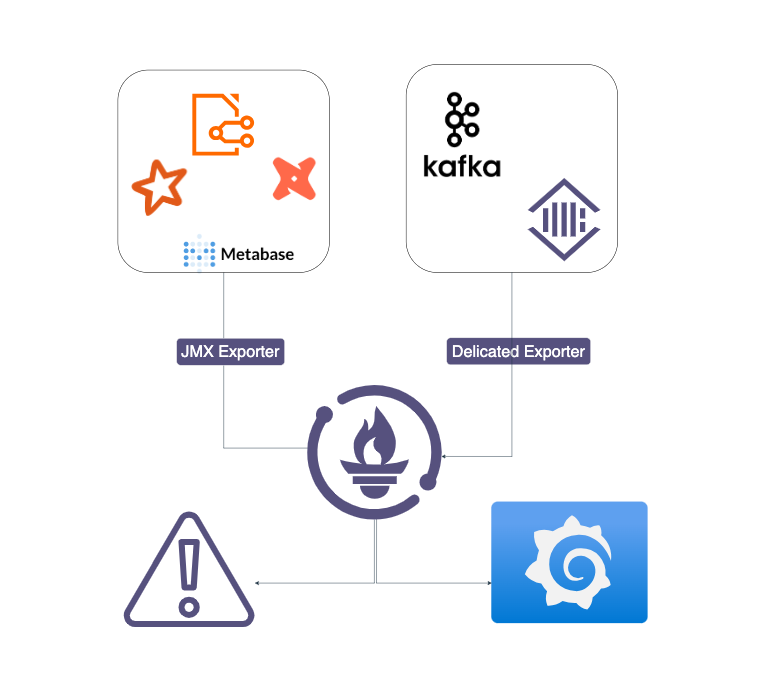

### **Overview**
This Readme outlines the problem statement, the required tools, and their uses.

### **Project Goal 🎯**
The goal is to build a data infrastructure for a company similar to Spotify that can process, store, and prepare reports on the massive data received in real time.

### **Technologies and Tools 🛠**
- **Databases:** HDFS 🐘, ClickHouse 🗄️
- **Workflow Management:** Apache Kafka 🐦, Apache Spark ✨
- **Data Visualization:** Metabase 🔍📊
- **Programming Languages:** Python 🐍, PySpark 🌟, DBT 🔄
- **Monitoring:** Grafana & Prometheus 🕵🏻
- **Other Tools:** Docker 🐳, Schema Registry 🗂, EventSim 🖥

Below is an explanation of what each of these tools will solve in this project:

### **EventSim 🖥**
EventSim is a Scala-based, Dockerized application that saves and generates new data for this project.

### **Kafka 🔌**
**Purpose:** 
Responsible for receiving and temporarily storing high-volume simulated data from EventSim. We also use AKHQ for visualizing Kafka metrics.

### **Spark 🔥**
**Purpose:** 
Processes the data from Kafka in micro-batches using Structured Streaming. The data is kept as raw as possible (only bad records are deleted) and stored in HDFS in the Bronze layer.

### **HDFS (Hive Partitioned + Parquet) 🐘🗄️**
**Purpose:** 
Acts as the primary database. Data from EventSim is transferred to HDFS using Kafka and Spark, and saved in the Bronze layer. The data is then cleaned and prepared in the Silver and Gold layers to generate business reports.

**Layers:**
- **Bronze Layer:** Preserves raw data in Parquet format with minimal changes, partitioned for better data volume control.
- **Silver Layer:** Cleans and removes redundant or broken fields from the Bronze data, forming basic dimensions and simple facts tables using Spark and DBT.
- **Gold Layer:** Creates final reports, calculating KPIs and key metrics. The data is aggregated and optimized for reporting.

### **ClickHouse & Metabase 🗄️🔍📊**
Gold data is imported into ClickHouse for better and more accurate reporting. Metabase is connected to ClickHouse for visualization of the final reports.

### **DBT**
dbt (data build tool) is an open-source tool for building and managing data models. It allows writing SQL scripts for cleaning, transforming, and modeling data into "models". In this project, DBT on Spark reads the Bronze layer data, transforms it, and stores it back into HDFS in the Silver layer.

### **Grafana & Prometheus**
Prometheus collects and stores metrics as time series data with timestamps, scraping metrics from various services and systems. Grafana integrates with Prometheus and other data sources to provide rich visualizations and dashboards, enabling real-time monitoring and analysis of metrics.

### **Exporters:**
1. **Kafka JMX Exporter:** Extracts metrics from Kafka, including the number of messages, lag, etc.
2. **Spark Exporter/JMX:** Monitors jobs, stages, and executors in Spark.
3. **HDFS/Hadoop Exporter:** Monitors NameNode, DataNode, ResourceManager, etc., in HDFS.
4. **ClickHouse Exporter:** Checks metrics like the number of queries, response speed, storage usage, etc.
5. **Node Exporter:** Monitors the resources of each node (part of the default Prometheus stack).

### **Schema Registry**
Schema Registry manages and maintains schemas in distributed systems, especially in the Kafka ecosystem. It ensures that data exchanged between producers and consumers is consistent and understandable, preventing errors.

When using Schema Registry with Kafka, the producer sends data to Kafka with a JSON serializer. The producer first registers the schema with the Schema Registry, which checks and validates the schema, assigning a unique ID to it. The producer then sends the data to Kafka along with this schema ID. Upon receiving the data and schema ID, the consumer queries the Schema Registry to retrieve the schema and interprets the data accordingly. Another common format used in Schema Registry, besides JSON, is Avro.

### **Docker Compose 🐳**
All services are defined in the `docker-compose.yml` file, making it easier to develop and test the entire setup. This includes Kafka, Spark, EventSim, Hadoop, ClickHouse, Metabase, Grafana, Prometheus, Schema Registry, and DBT.

### Architecture 
**Summary Architect**

**Complete Architect**

**Monitoring**

