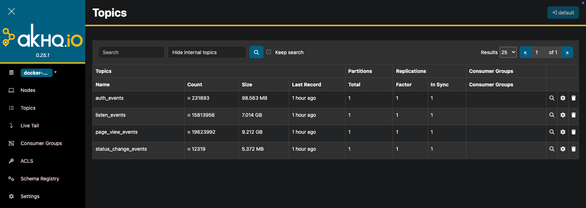

# **Apache Kafka: Technical Overview**

## **Introduction**

EventSim is a simulation tool used to generate realistic event data, which can be essential for testing and validating event-driven systems. Kafka, on the other hand, is a distributed event streaming platform capable of handling high-throughput, real-time data streams. Together, they form a powerful combination for simulating and processing event data.

## **Kafka Overview**

Kafka is an open-source distributed event streaming platform developed by the Apache Software Foundation. It is designed to handle real-time data feeds with the following key components:

- **Producers:** Applications that publish messages to Kafka topics.
- **Topics:** Categories to which records are sent by producers and from which records are retrieved by consumers. Topics are partitioned for scalability.
- **Consumers:** Applications that subscribe to Kafka topics and process the messages.
- **Brokers:** Servers that manage the persistence and replication of topic data.

Kafka is known for its high throughput, fault tolerance, and scalability. It is widely used for real-time analytics, event sourcing, and other applications requiring reliable data streaming.

## **EventSim and Kafka Integration**

EventSim can be used to generate various types of events, such as authentication events, listening events, page view events, and status change events. These events can be published to Kafka topics, allowing them to be consumed and processed by downstream applications.

### **KRaft vs. Zookeeper**

In this setup, KRaft (Kafka Raft) is used instead of Zookeeper for managing the Kafka broker service. KRaft is a newer metadata management mode for Kafka that eliminates the need for Zookeeper. Here's a comparison of KRaft and Zookeeper:

| Feature                   | KRaft                                         | Zookeeper                                          |
|---------------------------|-----------------------------------------------|----------------------------------------------------|
| **Architecture**          | Integrated metadata management within Kafka   | External metadata management service               |
| **Deployment Complexity** | Simplified deployment (no separate Zookeeper) | Requires separate deployment and management        |
| **Fault Tolerance**       | High availability with Raft protocol          | High availability with Paxos-like protocol         |
| **Performance**           | Improved performance and reduced latency      | Slightly higher latency due to external service    |
| **Operational Overhead**  | Lower operational overhead (single system)    | Higher operational overhead (managing two systems) |

### **Advantages of KRaft**

- **Simplified Deployment:** KRaft integrates metadata management within Kafka, eliminating the need for a separate Zookeeper deployment.
- **Improved Performance:** KRaft reduces latency and improves performance by managing metadata within Kafka itself.
- **Lower Operational Overhead:** With KRaft, there is no need to manage and maintain a separate Zookeeper cluster, reducing operational complexity.

### **Sample Kafka Messages**

Here's an example of messages generated by EventSim and consumed from Kafka topics:

#### **auth_events**

```json
{
  "ts": 1722085978727,
  "sessionId": 1456,
  "level": "paid",
  "itemInSession": 1,
  "city": "Council Bluffs",
  "zip": "51503",
  "state": "IA",
  "userAgent": "\"Mozilla/5.0 (X11; Linux x86_64) AppleWebKit/537.36 (KHTML, like Gecko) Ubuntu Chromium/36.0.1985.125 Chrome/36.0.1985.125 Safari/537.36\"",
  "lon": -95.784458,
  "lat": 41.223238,
  "userId": 1457,
  "lastName": "Terrell",
  "firstName": "Mckaylah",
  "gender": "F",
  "registration": 1722084181727,
  "success": true
}
```

#### **listen_events**

```json
{
  "artist": "The Cure",
  "song": "Just Like Heaven",
  "duration": 212.00934,
  "ts": 1722084241727,
  "sessionId": 3207,
  "auth": "Logged In",
  "level": "paid",
  "itemInSession": 11,
  "city": "Pearland",
  "zip": "77584",
  "state": "TX",
  "userAgent": "\"Mozilla/5.0 (Windows NT 6.1; WOW64) AppleWebKit/537.36 (KHTML, like Gecko) Chrome/36.0.1985.143 Safari/537.36\"",
  "lon": -95.350068,
  "lat": 29.545325,
  "userId": 673,
  "lastName": "Reyes",
  "firstName": "Makhila",
  "gender": "F",
  "registration": 1722084181727
}
```

#### **page_view_events**

```json
{
  "ts": 1722084227727,
  "sessionId": 739,
  "page": "Home",
  "auth": "Logged Out",
  "method": "GET",
  "status": 200,
  "level": "paid",
  "itemInSession": 105,
  "city": "Saint Anne",
  "zip": "60964",
  "state": "IL",
  "userAgent": "\"Mozilla/5.0 (Windows NT 6.1; WOW64) AppleWebKit/537.36 (KHTML, like Gecko) Chrome/36.0.1985.143 Safari/537.36\"",
  "lon": -87.744203,
  "lat": 41.038816
}
```

#### **status_change_events**

```json
{
  "ts": 1722102600727,
  "sessionId": 556,
  "auth": "Logged In",
  "level": "free",
  "itemInSession": 10,
  "city": "Houston",
  "zip": "77087",
  "state": "TX",
  "userAgent": "\"Mozilla/5.0 (Windows NT 6.3; WOW64) AppleWebKit/537.36 (KHTML, like Gecko) Chrome/36.0.1985.143 Safari/537.36\"",
  "lon": -95.304159,
  "lat": 29.685621,
  "userId": 557,
  "lastName": "Mccarty",
  "firstName": "Averee",
  "gender": "F",
  "registration": 1722084181727
}
```

## **Inspecting EventSim Messages with Kafka**

To inspect messages generated by EventSim, a Kafka consumer can be used. The consumer subscribes to Kafka topics and reads messages, allowing them to be processed and saved for analysis.

### **Kafka Consumer Explanation**

- **Configuration:** The Kafka consumer is configured with the address of the Kafka broker (`localhost:9092` in this case), a consumer group ID (`eventsim_inspector`), and an offset reset policy (`earliest`). These settings ensure the consumer can connect to Kafka, join a consumer group, and start reading messages from the beginning of the topics.

- **Subscribing to Topics:** The consumer subscribes to a list of topics (`auth_events`, `listen_events`, `page_view_events`, `status_change_events`). This allows it to read messages from these topics.

- **Reading Messages:** The consumer polls the Kafka broker to fetch messages. It processes each message by decoding it from bytes to a string format and then appends it to a list. This loop continues until a specified number of messages (batch size) is read from each topic.

- **Handling Errors:** The consumer handles potential errors, such as reaching the end of a partition, and logs any other errors encountered during message consumption.

- **Saving Results:** Once the messages are read, they can be saved to a file for further inspection. This is useful for analyzing the content of the messages and verifying the data generated by EventSim.

## AKHQ 

## **Conclusion**

Combining EventSim and Kafka provides a robust solution for simulating, consuming, and processing event data. This setup is invaluable for developing, testing, and validating event-driven architectures. The configuration and code examples showcased here illustrate how to seamlessly integrate these tools to achieve a scalable and efficient event simulation environment.

