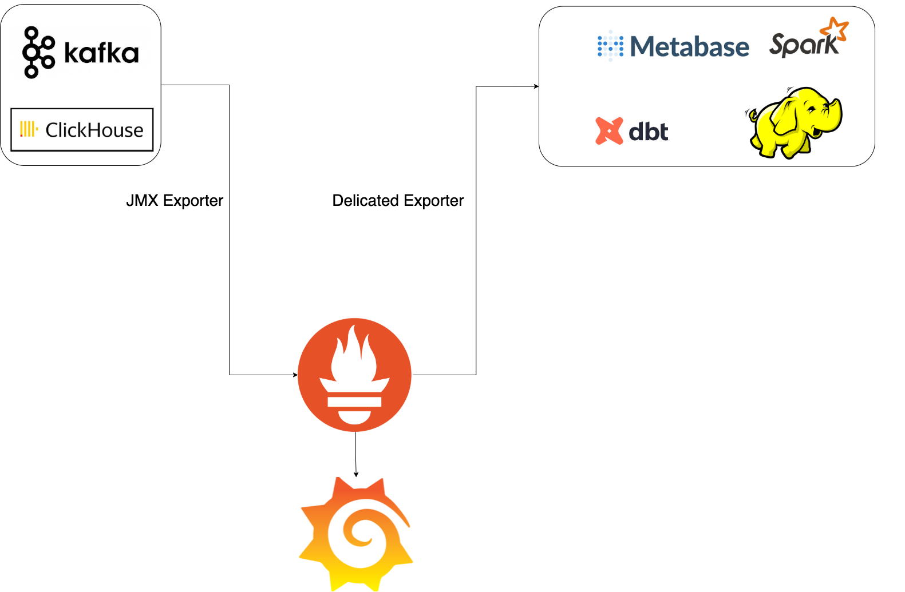

# Monitoring System Using Prometheus and Grafana

## Introduction

This project involves the development of a comprehensive monitoring system using Prometheus and Grafana. 
Monitoring is essential to ensure the reliability, performance, and availability of services. 
This guide provides a detailed comparison of using a **JMX Exporter** versus a **dedicated exporter** for various services, aiding in the decision-making process.

Using a **JMX Exporter** for all services is not necessarily the best approach. Whether to use a JMX Exporter or a **dedicated exporter** depends on the specific service, the metrics required, and the ease of configuration. 
The detailed comparison below helps to decide the best approach:

## When to Use JMX Exporter

JMX Exporters are suitable in the following scenarios:

1. **No Dedicated Exporter Exists**:
   - For services such as Spark, HDFS, or custom Java applications, JMX Exporters may be the only option to expose metrics.

2. **JVM-Level Metrics Are Required**:
   - JMX Exporters are optimal for exposing JVM metrics (e.g., heap memory, garbage collection, thread counts) for Java-based services.

3. **Custom Metrics Exposed via JMX**:
   - If the application exposes custom metrics via JMX, a JMX Exporter can scrape and expose them to Prometheus.

4. **Quick Setup**:
   - JMX Exporters are relatively easy to set up for Java applications, requiring only a Java agent and a configuration file.

## When to Use Dedicated Exporters

Dedicated exporters are preferable in the following scenarios:

1. **Purpose-Built Exporters Exist**:
   - Dedicated exporters are specifically designed for a service (e.g., `kafka-exporter`, `clickhouse-exporter`) and provide more structured, service-specific metrics.

2. **Better Performance**:
   - Dedicated exporters are often more efficient than JMX Exporters because they are optimized for the service being monitored.

3. **Easier Configuration**:
   - Dedicated exporters usually require minimal configuration compared to JMX Exporters, which may need custom rules for scraping JMX metrics.

4. **Additional Features**:
   - Dedicated exporters often provide additional features, such as pre-built dashboards, alerts, and support for service-specific metrics.

## Comparison: JMX Exporter vs. Dedicated Exporter

| Feature                     | JMX Exporter                          | Dedicated Exporter                  |
|-----------------------------|---------------------------------------|-------------------------------------|
| **Ease of Setup**           | Requires Java agent and config file   | Usually simpler to configure        |
| **Performance**             | Can be resource-intensive for JVM     | Optimized for the specific service  |
| **Metrics Coverage**        | Limited to JMX-exposed metrics        | Service-specific metrics            |
| **Custom Metrics**          | Supports custom JMX metrics           | Limited to what the exporter offers |
| **Pre-Built Dashboards**    | Requires manual dashboard creation    | Often comes with pre-built dashboards|
| **Service Support**         | Works for any Java-based service      | Specific to the service it monitors |

## Recommendations for Services

### Kafka
- **Use `kafka-exporter`**:
  - The `kafka-exporter` is purpose-built for Kafka and provides metrics such as consumer lag, topic offsets, and broker status.
  - A JMX Exporter is not necessary unless JVM-level metrics are required.

### Spark
- **Use JMX Exporter**:
  - There is no dedicated Spark exporter; therefore, a JMX Exporter is the best option.
  - It will expose Spark metrics (e.g., jobs, stages, executors) and JVM metrics.

### HDFS
- **Use JMX Exporter**:
  - HDFS components (NameNode, DataNode, etc.) expose metrics via JMX.
  - A JMX Exporter is the optimal method to scrape these metrics.

### ClickHouse
- **Use `clickhouse-exporter`**:
  - The [ClickHouse Exporter](https://github.com/ClickHouse/clickhouse_exporter) is purpose-built and provides more detailed metrics than a JMX Exporter.

### Other Java-Based Services
- **Use JMX Exporter**:
  - For custom Java applications or services without dedicated exporters, use a JMX Exporter.

## Example Setup

### Kafka (Dedicated Exporter)
```yaml
kafka-exporter:
  image: danielqsj/kafka-exporter:latest
  command: ["--kafka.server=broker:9092"]
  ports:
    - "9308:9308"
  networks:
    - data-highway

