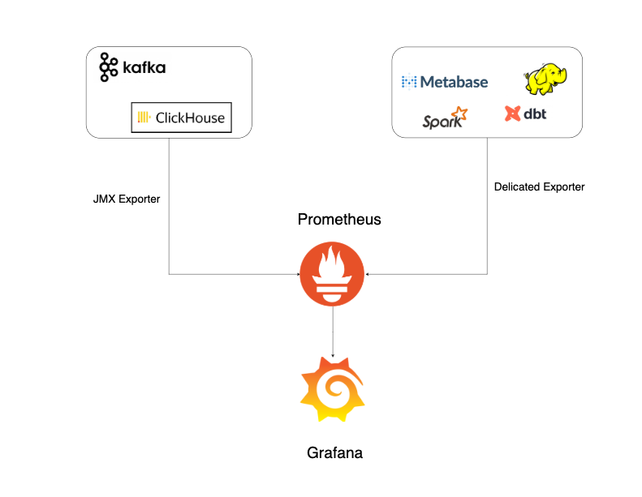

# Overview
This Readme describes the problem statement, the required tools, and their uses.

## Project goal 🎯
We are going to build a data infrastructure for a company similar to Spotify that can process, store, and prepare reports on the massive data that is sent to us in real time.

## Technologies and Tools 🛠
- **Databases**: HDFS 🐘, ClickHouse 🗄️
- **Workflow Management**: Apache Kafka 🐦, Apache Spark 🔥
- **Data Visualization**: Metabase 🔍📊
- **Programming Languages**: Python 🐍, DBT 🔄
- **Monitoring**: Grafana & Prometheus 🕵🏻
- **Other Tools**: Docker 🐳, Schema Registry 🗂, EventSim 🖥

**Below we explain what each of these tools will solve in this project**

### EventSim 🖥
EventSim is an application written in Scala and Dockerized, and our data is saved in this application and any new data is generated in it.

### Kafka 🔌
**Purpose**
- Responsible for receiving and temporarily storing high-volume simulated data from EventSim. 
- We also need a good visualization tool for Kafka, which we used in this section, AKHQ.

### Spark 🔥
**Purpose**
- In this part, we need to take the data in micro-batch form from Kafka as Structured Streaming, keep it as raw as possible (i.e. only delete bad records) and store it in HDFS in a layer called Bronze.
The bronze layer is a layer in HDFS that we will explain further there.

### HDFS (Hive Partitioned + Parquet) 🐘🗄️
**Purpose**
- We want to use this system as our database. We will transfer all the data from EventSim to HDFS using Kafka and Spark and save it in the Bronze layer. Then, in the Silver and Gold layers, we will clean the data and generate final reports that have business objectives.

Below, we explain each layer in more detail:

**Bronze layer**
- Preserve raw data in a structured format (usually Parquet) with minimal changes.
- Partitioning based on date/time or any other criteria, for better control of data volume.

**Silver layer**
- We take the bronze data, clean it up, and remove redundant or broken fields.
- Using Spark and a tool called DBT on Spark, we form basic dimensions and simple facts tables, and define analytical models in a modular way.

**Gold layer**
- Here is the final reporting and summarization layer. We have advanced fact tables (Facts) and full dimensions (Dimensions) that are obtained by aggregation and combining silver data.
- The goal of this layer is to create business-required reports, calculate KPIs and key metrics.
- Finally, we store this layer in HDFS (as before, Parquet format), but now the data is available in an optimized and aggregated form.

### ClickHouse & Metabase 🗄️🔍📊
- We import all Gold data into ClickHouse, so we can see the reports better and more accurately.
- also connect ClickHouse to Metabase for visualization, so we can see the visualization of the last layer reports.

### DBT
dbt (short for data build tool) is an open source tool for building and managing data models that was originally designed for traditional database environments (like PostgresSQL or Snowflake) and then found connectivity to Spark with dbt-spark or dbt-databricks. In fact, dbt is like a framework that allows you to write your own SQL scripts (used for cleaning, transforming, and modeling data) in the form of “models”.
Now in this project we will install DBT on Spark and read the data from the Bronze layer into HDFS and then transform it and store it back into HDFS, this time in the Silver layer.

### Grafana & Prometheus

### Schema Registry

### docker compose 🐳
- All services are defined in the docker-compose.yml file. Everything comes together, easier to develop and test.
All service means (Kafka, Spark, eventsim, hadoop, clickhouse, metabase, grafana, prometheus, schema registry, dbt)

## Architecture
**project architecture**
Summary:

**Complete architecture**

**Monitoring**:

